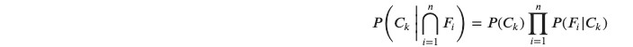

# Prologue

- An existential problem for any major website today is how to handle toxic and divisive content. 
- Quora wants to tackle this problem head-on to keep their platform a place where users can feel safe sharing their knowledge with the world.
- Quora is a platform that empowers people to learn from each other. 
- On Quora, people can ask questions and connect with others who contribute unique insights and quality answers. 
- A key challenge is to weed out insincere questions -- those **founded upon false premises**, or that **intend to make a statement rather than look for helpful answers**.

- I will try to follow Thomas Bayes and his game-changing theorem
- Thus, if we have certain classes, and n is the number of features, the probabiltiy of class k is:

# Examples

- "How can I get a remote web development job?" => Sincere
- "Why are Saudi Arabia and the UAE refusing even to take Joe Biden's phone call in March 2022?" => Insincere
- "What is an example that love can overcome many difficulties?" => Sincere
- "Why chinese hate indians?" => Insincere
- "What is the saddest part of being a programmer?" => Sincere
- "Which babies are more sweeter to their parents? Dark skin babies or white skin babies?" => Insincere
- "Are you doing your dream job?" => Sincere
- "Why do American firms steal technology from Chineses firms?" => Insincere

# Accuracy

- Model Accuracy = 89.4%
